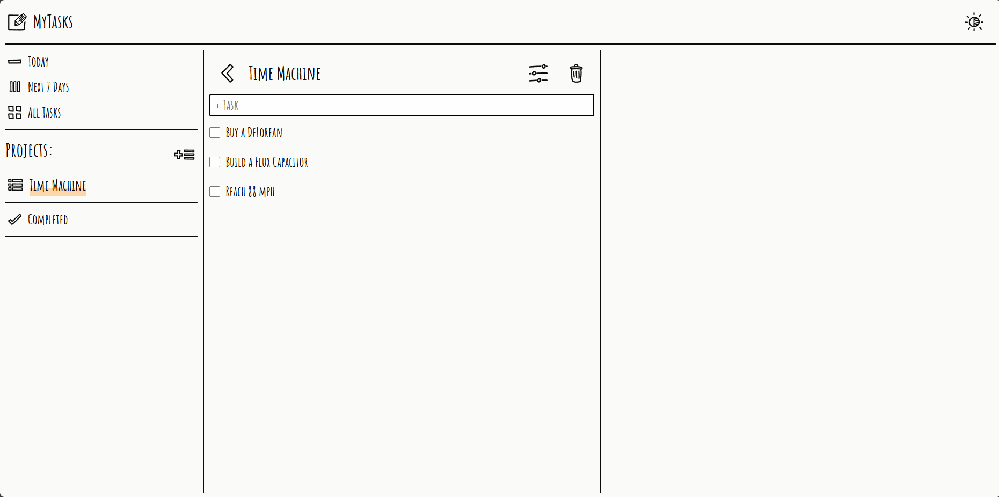

# My Tasks

Welcome to **My Tasks!** This web application helps you manage and schedule your tasks with a handwritten notebook feel. In my day-to-day life, I love using my notebook to keep track of my tasks, so I aimed to recreate that personal and cozy aesthetic in this To-Do App.

## Demo

## Features

- Sortable Tasks: Organize tasks by due date or priority for efficient management.
- Simple Deadline Reminder: Task due dates are presented in user-friendly terms for quick understanding.
- Filtering Options: Filter tasks by time, project, or completion status.
- Editable Tasks and Projects: Tasks and Projects titles can be renamed and edited to keep everything current.

## What I learned from the Project

- Implemented the **PubSub** model for better organization and communication between components.
- Gained experience using **npm** packages for streamlined development.
- Learned how to utilize **Webpack** for effective resource bundling.

## Live Preview

Click [here](https://zukurai-kushal.github.io/to-do/) to view the live page.
